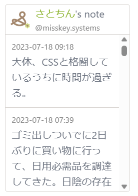

# Misskey Timeline Viewer
Misskeyの投稿をiframeで埋め込み表示するためのものです。

動作環境 -> https://mtlv.satocheeen.com/

- 投稿を最新20件まで表示します。
- 以下は非対応です。
  - 絵文字
  - Renote
- 機能
  - Misskeyのタイムラインをブログ等に埋め込むためのスクリプトを生成
  - スクリプトをブログ等に埋め込むと、Misskeyのタイムラインを表示



## 自前で構築する場合

Docker Hubにビルドイメージを置いているので、Docker環境のあるサーバ上で以下docker-compose.ymlを配置すれば、環境構築できます。

```
version: "3"
services:
  main:
    image: satocheeen/misskey-timeline-viewer:1.0.0
    ports: 
        - [port]:80
    volumes:
        - [log folder path]:/var/log/www
```

イメージバージョンは、以下で確認してください。

https://hub.docker.com/repository/docker/satocheeen/misskey-timeline-viewer/

## Development
1. start backend server
   ```
   cd backend
   npm i
   npm run dev
   ```
2. start frontend
   ```
   npm i
   npm start
   ```

## Deployment
1. make a Dcoker image
   ```
   docker image build -t misskey-timeline-viewer .
   ```
2. operation check
   ```
   docker-compose up -d
   ```
   open http://localhost/ in your browser.
3. push the Docker image
   ```
   docker image tag misskey-timeline-viewer xxxx/xxxx:X.X.X
   docker push xxxx/xxxx:X.X.X
   ```

## Copyright
Copyright (c) 2023 satocheeen.com

Released under the MIT license
